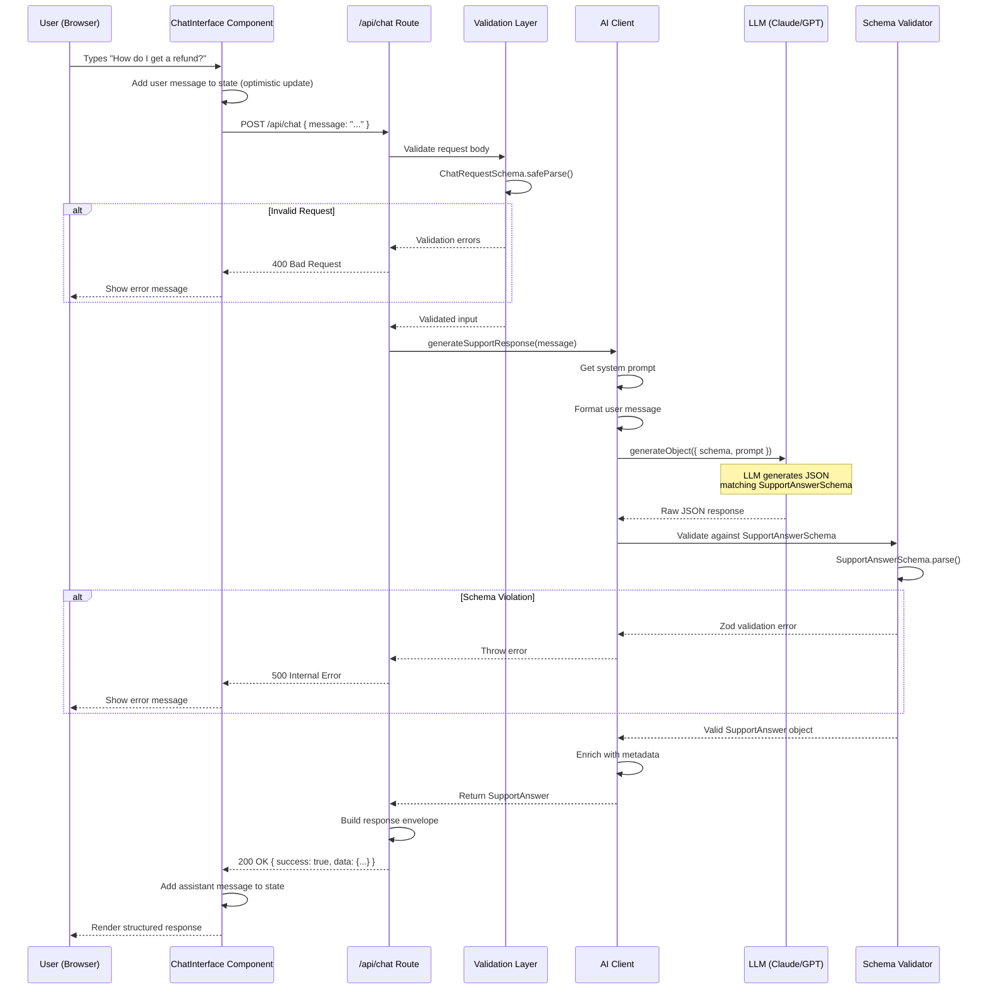

# Data Flow Documentation

> **Purpose**: Trace a request through the entire system from user input to rendered response

## Overview

This document provides a detailed walkthrough of how data flows through the Support Agent application. Follow along with code references to understand each step.

---

## Complete Request Flow Diagram



---

## Step-by-Step Walkthrough

### Step 1: User Input

**Location**: `components/chat/InputArea.tsx:38-45`

```typescript
const handleSubmit = () => {
  if (!input.trim() || isLoading) return;

  onSend(input);
  setInput('');
};
```

**What happens**:
1. User types message and clicks send
2. Input validation (must not be empty)
3. Call parent's `onSend` handler
4. Clear input field

**Data shape**:
```typescript
input: string // Raw user input: "How do I get a refund?"
```

---

### Step 2: Optimistic UI Update

**Location**: `components/chat/ChatInterface.tsx:34-42`

```typescript
const userMessage: Message = {
  id: `user-${Date.now()}`,
  role: 'user',
  content: message,
  timestamp: new Date(),
};

setMessages(prev => [...prev, userMessage]);
setIsLoading(true);
```

**What happens**:
1. Create user message object
2. Immediately add to state (don't wait for API)
3. Set loading state
4. UI updates instantly (better UX)

**Data shape**:
```typescript
userMessage: {
  id: "user-1705345678901",
  role: "user",
  content: "How do I get a refund?",
  timestamp: Date,
}
```

**Why optimistic updates?**
- Feels faster to users
- Reduces perceived latency
- Standard pattern in modern UIs

---

### Step 3: API Call

**Location**: `components/chat/ChatInterface.tsx:46-52`

```typescript
const response = await fetch('/api/chat', {
  method: 'POST',
  headers: { 'Content-Type': 'application/json' },
  body: JSON.stringify({ message }),
});
```

**What happens**:
1. HTTP POST to `/api/chat`
2. Send message as JSON
3. Wait for response
4. Error handling if failed

**Data transmitted**:
```json
{
  "message": "How do I get a refund?"
}
```

---

### Step 4: Request Validation

**Location**: `app/api/chat/route.ts:46-66`

```typescript
// Parse request body
const body = await request.json();

// Validate request against schema
const validation = ChatRequestSchema.safeParse(body);

if (!validation.success) {
  return Response.json(
    {
      error: {
        code: 'VALIDATION_ERROR',
        message: 'Invalid request format',
        // ...
      },
    },
    { status: 400 }
  );
}

const { message, debug } = validation.data;
```

**What happens**:
1. Parse JSON body
2. Validate against `ChatRequestSchema`
3. If invalid: return 400 error with details
4. If valid: extract typed data

**Schema definition**: `lib/schemas/validation.ts:67-92`

```typescript
export const ChatRequestSchema = z.object({
  message: z.string()
    .min(1, 'Message is required')
    .max(1000, 'Message exceeds maximum length')
    .transform(str => str.trim()),

  debug: z.boolean()
    .optional()
    .default(false),
});
```

**Why validate?**
- Prevent invalid data early
- Security (max length prevents abuse)
- Type safety (TypeScript knows shape)
- Clear error messages

**Validated data shape**:
```typescript
{
  message: "How do I get a refund?", // trimmed
  debug: false
}
```

---

### Step 5: AI Response Generation

**Location**: `app/api/chat/route.ts:73`

```typescript
const supportAnswer = await generateSupportResponse(message);
```

Calls → `lib/ai/client.ts:40-115`

```typescript
export async function generateSupportResponse(
  userQuery: string
): Promise<SupportAnswer> {
  // Get configured model
  const { model, config } = getModel();

  // Format inputs
  const systemPrompt = getSystemPrompt();
  const userMessage = formatUserMessage(userQuery);

  // Generate structured output
  const result = await generateObject({
    model,
    schema: SupportAnswerSchema,
    system: systemPrompt,
    prompt: userMessage,
    temperature: GENERATION_SETTINGS.temperature,
    maxTokens: GENERATION_SETTINGS.maxTokens,
  });

  return enrichedResponse;
}
```

**What happens**:

**5.1 Get Model Configuration**
```typescript
const { model, config } = getModel();
// Returns: { model: anthropic('claude-3-5-sonnet-20241022'), config: {...} }
```

**5.2 Get System Prompt**
```typescript
const systemPrompt = getSystemPrompt();
// Returns: "You are a helpful and knowledgeable customer support agent..."
```

**5.3 Call AI SDK**
```typescript
const result = await generateObject({
  model,                      // AI provider client
  schema: SupportAnswerSchema, // Zod schema for validation
  system: systemPrompt,       // Instructions
  prompt: userMessage,        // User's question
  temperature: 0.7,           // Creativity vs consistency
  maxTokens: 2048,           // Response length limit
});
```

**Under the hood** (AI SDK internals):

1. Convert Zod schema to JSON Schema
2. Construct prompt:
   ```
   System: [system prompt]
   User: [user message]
   Assistant: You must respond with JSON matching this schema: {...}
   ```
3. Call LLM API
4. Parse JSON response
5. Validate against Zod schema
6. Return typed object

**5.4 Response Enrichment**
```typescript
const enrichedResponse: SupportAnswer = {
  ...result.object,
  metadata: {
    processing_time_ms: 1250,
    model_used: "claude-3-5-sonnet-20241022",
    layer: "L0-basic",
    prompt_version: "1.0",
  },
};
```

---

### Step 6: Schema Validation

**Location**: Inside AI SDK (automatic)

The AI SDK validates the LLM response against our schema:

```typescript
// Pseudo-code (inside AI SDK)
const llmOutput = await fetchFromLLM(...);
const parsed = JSON.parse(llmOutput);
const validated = SupportAnswerSchema.parse(parsed); // ← Validation happens here
```

**If validation fails**:
- AI SDK may retry (depends on configuration)
- Eventually throws error
- Error propagates to API route
- `handleAPIError()` processes it

**If validation succeeds**:
- Returns fully typed object
- TypeScript knows all fields
- No runtime surprises

**Validated data shape**:
```typescript
{
  final_answer: "Your refund has been processed and will appear...",
  confidence: 0.92,
  category: "billing",
  followups: [
    "When will I see the refund in my account?",
    "Can I get a receipt for this refund?"
  ],
  citations: ["refund-policy"],
  requires_human: false,
  metadata: {
    processing_time_ms: 1250,
    model_used: "claude-3-5-sonnet-20241022",
    layer: "L0-basic",
    prompt_version: "1.0"
  }
}
```

---

### Step 7: Response Envelope

**Location**: `app/api/chat/route.ts:77-92`

```typescript
const response = {
  success: true,
  data: supportAnswer,
  metadata: {
    request_id: requestId,
    timestamp: new Date().toISOString(),
    processing_time_ms: processingTime,
  },
  ...(debug && {
    debug: {
      schema_version: '1.0',
      model: supportAnswer.metadata?.model_used,
      prompt_version: supportAnswer.metadata?.prompt_version,
    },
  }),
};

return Response.json(response);
```

**What happens**:
1. Wrap `SupportAnswer` in standard envelope
2. Add metadata (request ID, timestamp, timing)
3. Include debug info if requested
4. Return JSON response with 200 status

**Final API response**:
```json
{
  "success": true,
  "data": {
    "final_answer": "Your refund has been processed...",
    "confidence": 0.92,
    "category": "billing",
    "followups": ["...", "..."],
    "citations": ["refund-policy"],
    "requires_human": false,
    "metadata": {
      "processing_time_ms": 1250,
      "model_used": "claude-3-5-sonnet-20241022",
      "layer": "L0-basic",
      "prompt_version": "1.0"
    }
  },
  "metadata": {
    "request_id": "abc123def456",
    "timestamp": "2025-01-15T10:30:45.123Z",
    "processing_time_ms": 1350
  }
}
```

---

### Step 8: Client Update

**Location**: `components/chat/ChatInterface.tsx:54-62`

```typescript
const data = await response.json();

const assistantMessage: Message = {
  id: `assistant-${Date.now()}`,
  role: 'assistant',
  content: data.data.final_answer,
  structured_data: data.data,
  timestamp: new Date(),
};

setMessages(prev => [...prev, assistantMessage]);
```

**What happens**:
1. Parse JSON response
2. Extract `final_answer` for display
3. Store full `structured_data` for UI features
4. Add to messages state
5. React re-renders

---

### Step 9: UI Rendering

**Location**: `components/chat/MessageBubble.tsx:20-80`

```typescript
<MessageBubble message={message} />
```

**Renders**:

1. **Message bubble** with answer text
2. **Confidence indicator** (progress bar)
3. **Category badge** (colored pill)
4. **Follow-up questions** (expandable list)
5. **Citations** (source links)
6. **Timestamp** (formatted time)

**Data binding examples**:

```tsx
{/* Confidence */}
<div style={{ width: `${percentage}%` }} />

{/* Category */}
<span className={colors[category]}>
  {category.replace('_', ' ')}
</span>

{/* Follow-ups */}
{message.structured_data.followups.map((q, i) => (
  <li key={i}>{q}</li>
))}
```

---

## Data Transformations Summary

```
User Input (string)
  ↓
ChatRequest (validated object)
  ↓
AI Prompt (string)
  ↓
LLM Response (JSON string)
  ↓
SupportAnswer (validated object)
  ↓
API Response (envelope with metadata)
  ↓
UI State (Message object)
  ↓
Rendered UI (React components)
```

---

## Error Flow

### Validation Error

```
User sends empty message
  ↓
ChatInterface validates client-side (prevents send)
```

### API Validation Error

```
Malformed POST body
  ↓
ChatRequestSchema.safeParse() fails
  ↓
Return 400 with error details
  ↓
UI shows error banner
```

### AI Generation Error

```
LLM API timeout
  ↓
generateObject() throws
  ↓
handleAPIError() catches
  ↓
Return 502 with user-friendly message
  ↓
UI shows error banner
```

### Schema Violation Error

```
LLM returns invalid confidence (1.5)
  ↓
SupportAnswerSchema.parse() fails
  ↓
Zod throws validation error
  ↓
AI SDK may retry
  ↓
Eventually throw to API route
  ↓
Return 500 with sanitized error
  ↓
UI shows error banner
```

---

## Performance Timing

**Typical request breakdown** (Layer 0):

```
User clicks send:           0ms
  ├─ Client validation:     <1ms
  ├─ HTTP request setup:    5ms
  ├─ API route receives:    +10ms
  ├─ Request validation:    +1ms
  ├─ LLM generation:        +1200ms  ← Majority of time
  ├─ Schema validation:     +2ms
  ├─ Response building:     +1ms
  └─ HTTP response:         +5ms
UI renders:                 1224ms total
```

**Optimization opportunities** (future layers):
- Streaming responses (perceived speed)
- Caching common queries
- Response compression
- CDN for static assets

---

## Debugging a Request

### Using Browser DevTools

1. **Network tab**: See request/response
2. **Console**: Check for errors
3. **React DevTools**: Inspect component state

### Using Debug Mode

```typescript
// Add to API call
fetch('/api/chat', {
  method: 'POST',
  body: JSON.stringify({ message: "test", debug: true }),
});
```

**Debug response includes**:
```json
{
  "debug": {
    "schema_version": "1.0",
    "model": "claude-3-5-sonnet-20241022",
    "prompt_version": "1.0"
  }
}
```

### Using Logs

**Server logs** (terminal running `npm run dev`):
```
ℹ️ [10:30:45] Chat request received { request_id: 'abc123' }
ℹ️ [10:30:45] Request validated { message_length: 22 }
ℹ️ [10:30:46] Support response generated { confidence: 0.92 }
ℹ️ [10:30:46] Chat request completed { processing_time_ms: 1250 }
```

---

## Key Takeaways

1. **Validation happens at boundaries** (input and output)
2. **Schemas ensure type safety** throughout the flow
3. **Metadata enrichment** aids debugging
4. **Optimistic updates** improve UX
5. **Error handling is layered** (fail gracefully)
6. **Logs trace the journey** (request ID)

**Next Steps**:
- Read `LEARNING_PATH.md` for structured curriculum
- Try the experiments in `experiments/README.md`
- Inspect actual requests in `/debug` view
