# Visual Diagrams - Layer 0

> **Purpose**: All Mermaid diagrams for understanding system architecture

## Table of Contents

1. [Sequence Diagram - Complete Request Flow](#sequence-diagram)
2. [Data Flow Diagram](#data-flow-diagram)
3. [Component Hierarchy](#component-hierarchy)
4. [Schema Validation Flow](#schema-validation-flow)
5. [Error Handling Flow](#error-handling-flow)
6. [Architecture Layers](#architecture-layers)

---

## Sequence Diagram - Complete Request Flow


**Usage**: Trace a single request from start to finish

---

## Data Flow Diagram


**Usage**: Understand data transformations

---

## Component Hierarchy


**Legend**:
- 🔵 Blue: Server Components (no client JS)
- 🟠 Orange: Client Components (interactive)
- 🟣 Purple: Presentational Components

**Usage**: Understand component organization

---

## Schema Validation Flow


**Usage**: Understand schema validation lifecycle

---

## Error Handling Flow


**Usage**: Debug error scenarios

---

## Architecture Layers

```mermaid
graph TB
    subgraph UI[Presentation Layer]
        PC[Page Components]
        CC[Chat Components]
        DC[Debug Components]
    end

    subgraph API[API Layer]
        Route[/api/chat Route]
        Validation[Input Validation]
        ErrorHandler[Error Handling]
    end

    subgraph Business[Business Logic Layer]
        Client[AI Client]
        Prompts[Prompt Management]
        Config[Configuration]
    end

    subgraph Data[Data Layer]
        Schemas[Zod Schemas]
        Types[TypeScript Types]
    end

    subgraph External[External Services]
        Anthropic[Anthropic API]
        OpenAI[OpenAI API]
    end

    UI --> API
    API --> Business
    Business --> Data
    Business --> External

    style UI fill:#e3f2fd
    style API fill:#fff3e0
    style Business fill:#f3e5f5
    style Data fill:#c8e6c9
    style External fill:#ffecb3
```

**Usage**: Understand separation of concerns

---

## Type Safety Flow

```mermaid
flowchart LR
    subgraph Schema[Zod Schema]
        ZD[Schema Definition<br/>Runtime]
    end

    subgraph Inference[Type Inference]
        TI[z.infer&lt;Schema&gt;<br/>Compile Time]
    end

    subgraph Validation[Runtime]
        RV[Schema.parse<br/>Validates Data]
    end

    subgraph TypeScript[Compile Time]
        TC[TypeScript Check<br/>Validates Code]
    end

    ZD -.->|Infer| TI
    ZD -->|Used by| RV
    TI -->|Used by| TC

    RV --> Runtime[Runtime Safety ✓]
    TC --> Compile[Compile Safety ✓]

    style ZD fill:#c8e6c9
    style TI fill:#b3e5fc
    style RV fill:#fff9c4
    style TC fill:#f3e5f5
    style Runtime fill:#c8e6c9
    style Compile fill:#c8e6c9
```



**Usage**: Understand type safety guarantees

---

## Prompt Engineering Pattern

```mermaid
graph TD
    subgraph Prompt[System Prompt]
        Role[Role Definition<br/>"You are a support agent"]
        Bounds[Capability Boundaries<br/>"You can help with..."]
        Guide[Quality Guidelines<br/>"Be concise..."]
        Meta[Self-Assessment<br/>"Include confidence"]
        Examples[Few-Shot Examples<br/>"Good response: {...}"]
    end

    subgraph Generation
        LLM[LLM Processing]
    end

    subgraph Output
        Structured[Structured Response<br/>Matches Schema]
    end

    Role --> LLM
    Bounds --> LLM
    Guide --> LLM
    Meta --> LLM
    Examples --> LLM

    LLM --> Structured

    style Role fill:#e3f2fd
    style Bounds fill:#fff3e0
    style Guide fill:#f3e5f5
    style Meta fill:#fff9c4
    style Examples fill:#ffecb3
    style LLM fill:#c8e6c9
    style Structured fill:#b3e5fc
```

**Usage**: Understand prompt structure

---

## Development Workflow


**Usage**: Follow development workflow

---

## State Management (Layer 0)

```mermaid
graph LR
    subgraph Component[ChatInterface Component]
        State[Local State<br/>useState]
        Messages[messages: Message[]]
        Loading[isLoading: boolean]
        Error[error: string | null]
    end

    subgraph Events
        UserInput[User Input Event]
        APICall[API Call Event]
        Response[API Response]
    end

    UserInput --> State
    State --> APICall
    APICall --> Response
    Response --> State

    State --> Messages
    State --> Loading
    State --> Error

    Messages --> Render[Render Messages]
    Loading --> Render
    Error --> Render

    style State fill:#e3f2fd
    style Messages fill:#c8e6c9
    style Loading fill:#c8e6c9
    style Error fill:#c8e6c9
    style UserInput fill:#fff3e0
    style APICall fill:#fff3e0
    style Response fill:#fff3e0
    style Render fill:#f3e5f5
```

**Usage**: Understand state management

---

## How to Use These Diagrams

### In Documentation
- Copy Mermaid code blocks into Markdown
- GitHub/GitLab render automatically
- Use in README, docs, PRs

### In Presentations
- Paste into [Mermaid Live Editor](https://mermaid.live)
- Export as PNG/SVG
- Include in slides

### For Learning
- Study one diagram at a time
- Match diagram to code
- Add your own annotations

### For Debugging
- Trace actual requests against diagrams
- Identify where flow deviates
- Update diagrams as system evolves

---

## Suggested Exercises

1. **Create a new diagram** showing the `/debug` page flow
2. **Modify the sequence diagram** to include error cases
3. **Design a diagram** for your Layer 1 observability additions
4. **Draw by hand** the data flow without looking at the diagram

---

## Diagram Tools

### Recommended
- [Mermaid Live Editor](https://mermaid.live) - Online editor
- [Excalidraw](https://excalidraw.com) - Hand-drawn style
- [tldraw](https://www.tldraw.com) - Simple whiteboarding

### For Advanced Users
- [PlantUML](https://plantuml.com) - Text-based UML
- [draw.io](https://app.diagrams.net) - Full-featured
- [Lucidchart](https://www.lucidchart.com) - Professional

---

**Remember**: Diagrams are learning aids. They should clarify, not complicate!
